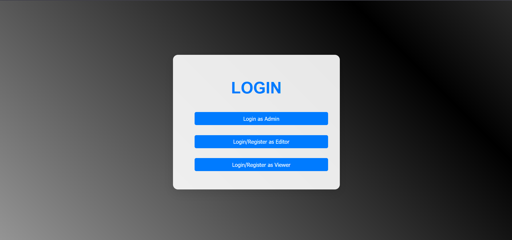
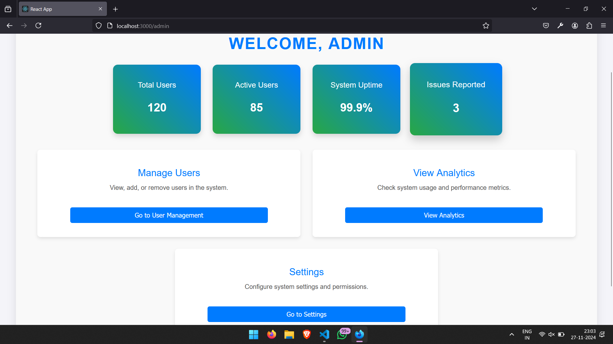
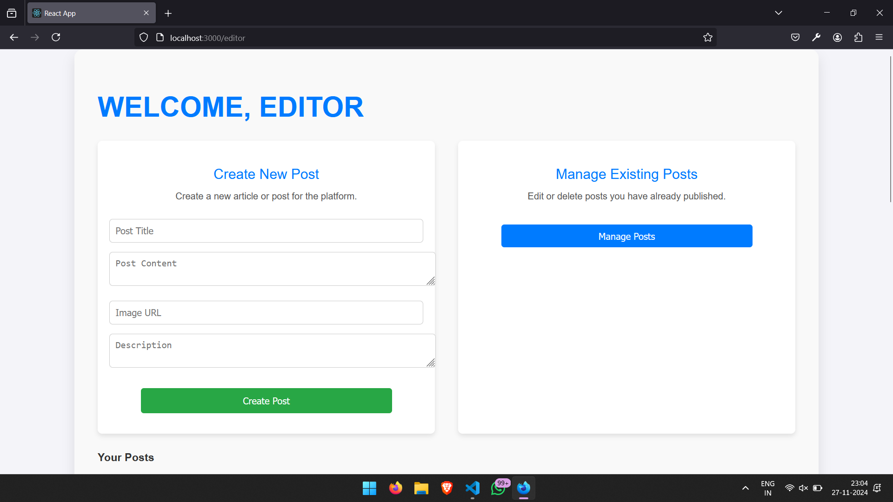
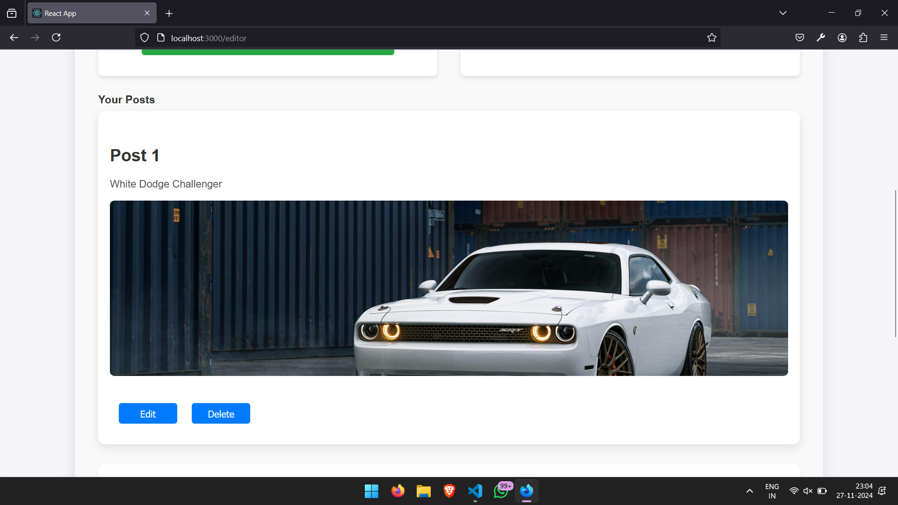
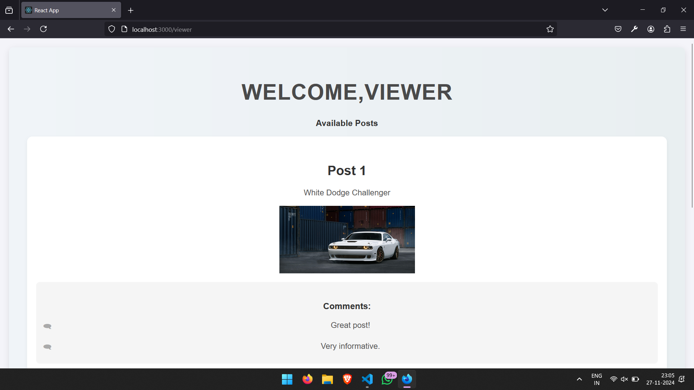
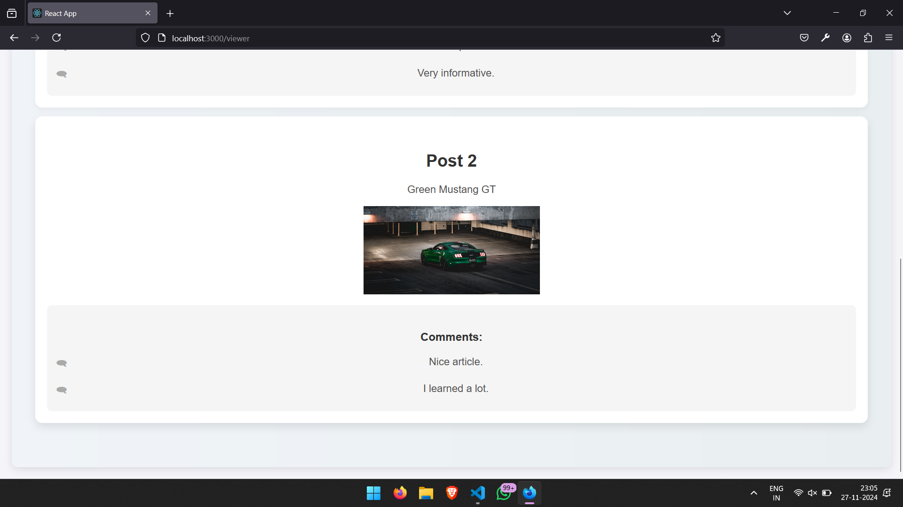

# VRV_RBAC
This project is a react based application that is an assessment of VRV Securities 

OBJECTIVE: To evaluate your creativity, understanding, and technical skills in building a Role-Based Access Control (RBAC) User Interface. This assignment is designed to give you the flexibility to showcase your problem-solving abilities and your personal approach to designing secure and functional UIs.

## Table of Contents

1. [Features](#features)
2. [Technologies Used](#technologies-used)
3. [File Structure](#file-structure)
4. [Screenshots](#screenshots)
5. [Contributing](#contributing)
6. [License](#license)

## Features

### Admin Panel
- Centralized interface to manage user roles and permissions.
- Assign users as Editors or Viewers based on their responsibilities.
- Monitor activity logs for posts created, edited, or viewed.
- Upcoming feature: Advanced role-based access controls (RBAC).

### Editor Panel
- Create new posts by filling in details such as:
  - **Title**
  - **Content**
  - **Image URL**
  - **Description**
- Real-time updates of created posts visible in the Viewer Panel.
- User-friendly interface for managing existing posts.
  - **Edit** and **Delete** functionality for published posts (Edit/Delete buttons currently placeholders).
- Dynamic image and description rendering for each post.
- Fully responsive design for smooth user experience across devices.

### Viewer Panel
- View all posts created by the Editor in a visually appealing format.
- Posts displayed with:
  - **Title**
  - **Content**
  - **Images**
  - **Descriptions**
- Dedicated comments section for each post, showcasing example comments.
- Read-only mode to prevent unintended modifications.
- Clean, responsive layout optimized for readability.

### General Features
- Seamless synchronization between the Editor and Viewer Panels using React's state management.
- Modular components for easy code maintenance and scalability.
- Stylish and modern UI design tailored for user engagement.

## Technologies Used

- **React**: Front-end library for building the UI.
- **CSS**: Styling the components for a modern and clean look.
- **JavaScript (ES6)**: Logic and interactivity.

src/
├── components/
│   ├── EditorPanel.jsx    # Editor Panel component
│   ├── ViewerPanel.jsx    # Viewer Panel component
│
├── styles/
│   ├── EditorPanel.css    # Styles for Editor Panel
│   ├── ViewerPanel.css    # Styles for Viewer Panel
│
├── assets/
│   ├── logo.svg           # Project logo
│   ├── bg2.jpg            # Example background image 1
│   ├── bg5.jpg            # Example background image 2
│
├── App.js                 # Main application entry
├── index.js               # Application entry point

## Screenshots

### Mainpage

## Admin Page
username: admin
password: password123

## Editor Page

## Viewer Page

